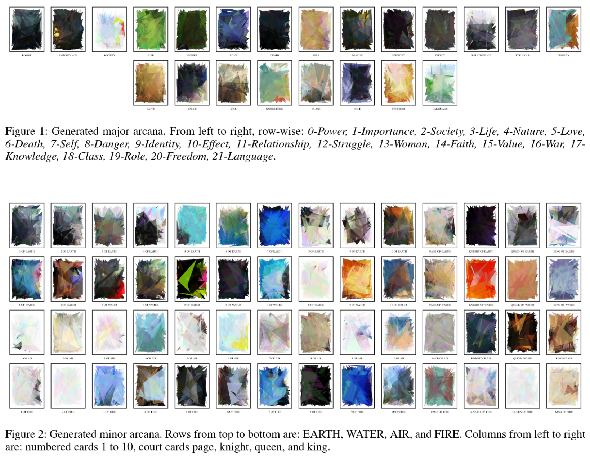
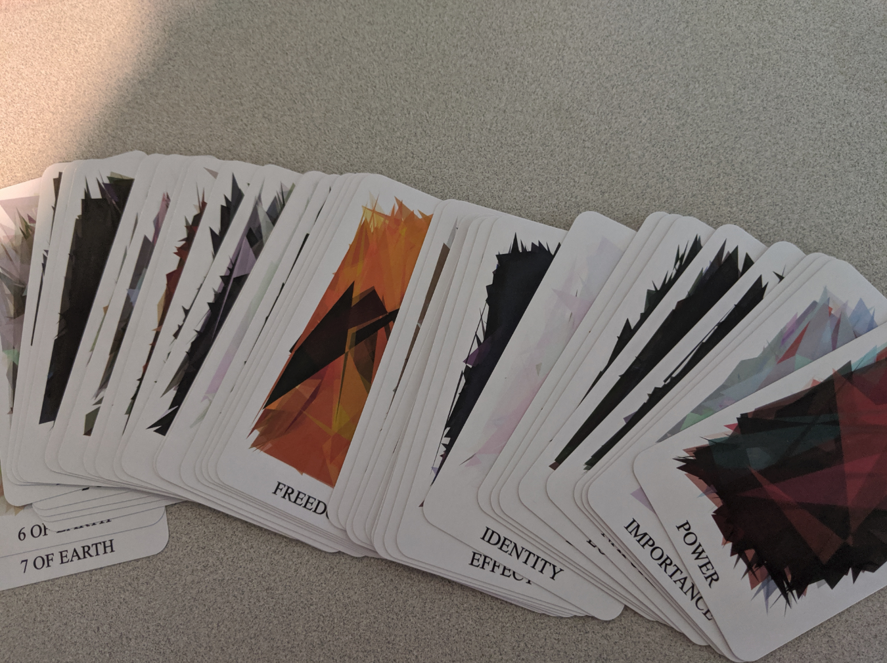

# Generative Tarot

See paper [here](EXAG_Workshop__Generative_Tarot.pdf).

### usage instructions

- Start with a text file *themestext* that contains a list of concepts.
  - In my example, *themestext* was generated by *scrape.py*.
- Run *process.py*. This creates *trumpstext* and *theresttext*.
- Run *maketrumpcards.py*. This creates the trump cards, and creates the first half of *booklet.md* which contains the advised readings.
- Run the Jupyter notebook *makesuitcards*. This creates the suitcards, and creates the second half of *booklet.md*.

### example output

#### This a generation using the data in this repo. Figure taken from paper.↓

#### This is another generation.↓

See the whole set of generated cards in svg format [here](cards).

See the images from Google that were the "inspiration" for the card face image [here](found_imgs).

See the corresponding booklet [here](booklet.md).

### credits

The image approximation used for generation of card illustrations was lightly adapted from [alteredqualia](https://alteredqualia.com/visualization/evolve/)'s implementation of Roger Alsing's algorithm: genetic_approx.py.

